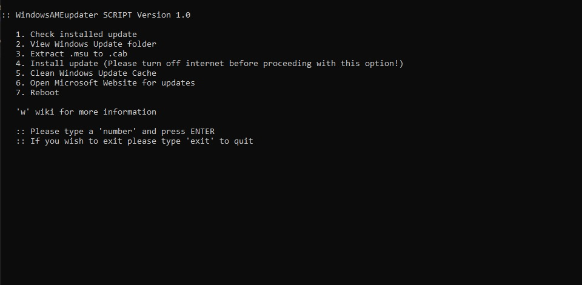

# ⚠ This is deprecated

# windowsAMEupdater

Congrats to those who have already installed the Windows Ameliorated!

I have been using the Windows Ameliorated for over three months. I would say that Windows Ameliorated is a great project for someone who does not like those "bloat" in their Windows 10 operating system. (Reason why I use Windows Ameliorated, is because I got mad at the Windows Update that forced reboot when I'm in the middle of the critical mission.)

Installing the cumulative updates can take up to 30 minutes for the whole process(That's what I am experiencing now) So, knowing manual install Windows Update can be time-consuming. Whenever I wanted to install the Windows Update, I need to refer back to the installation commands. So, here's my solution to those "tedious" steps.

### windowsAMEupdater
Works with Windows 10 Version 1903, 2004, 20H2 and so on. Only works offline.

Size         :  7,528 Bytes*

Installation :  no (Portable)

Depencency   :  Mozilla Firefox web Browser

Assumption   :  User has already installed Windows updates before and knowing how everything works.

#### Features:
1. Able to check installed update
2. Extract .msu to .cab 
3. Install update 
4. Shortcut link to the Microsoft Website for updates
5. Shortcut link to Windows Ameliorated Wiki
6. Clean Windows Update Cache
7. Reboot 

*The windowsAMEupdater required Administrator in order to run the script.*

The windowsAMEupdater will create a folder named "winUp" in your C:\ directory. 

#### Tutorial:
Right click on the *windowsAMEupdater.bat* and click on "Run as Administrator". Then you will be presented with this page. 

User will have to type in their desired number in the command prompt. 

|Input  |Description|
|-------|-----------|
|1      |View the previously installed update in your system.|
|2      |Opens up the "C:\winUp" in Windows explorer|
|3      |Helps user to extract msu to cab in their respectively update's name.|
|4      |This will list out the extracted msu in the "update-files" folder. If user does perform Windows Update, the chosen update folder will be moved to "C:\winUp\update-files\installed" to help reduce confusion for user.|
|5      |This will help user clean the Windows Update Cache after user has done installed Windows Update.|
|6      |Open up the Microsoft Update history and Microsoft Update Catalog in Firefox browser| 
|7      |Reboots user's system|
|w      |Opens up the Windows Ameliorated's wiki|
|exit   |Exits the *windowsAMEupdater*|

#### How to install Update using windowsAMEupdater:
1. Launch *windowsAMEupdater* as administrator
2. Open winUp folder in Main Menu
3. Move downloaded msu files to "msu-files" folder
4. Select "Extract .msu to .cab" to extract the files from msu to cab
5. Back to Main Menu and install Update
6. Choose your update files 
7. Reboot!
8. Voilà

For more information, please head over to [Windows Ameliorated wiki](https://wiki.ameliorated.info/)
This script currently and only tested on Windows 10 Version 2004 build*

I hope this helps everyone to reduce their time to install the Windows Update. :)

*This script has been intended to help reduce user's time not to expect the full automation of installation of Windows Update.* ***Please use it at your own risk.***

If there's any feedback/problems do post the issues! Thank you!

Remark: * - subject will be changed
